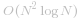
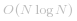

[TOC]


## Solution
---
#### Approach #1: Coordinate Compression

**Intuition**

<center>
    
</center>

Suppose instead of `rectangles = [[0,0,2,2],[1,0,2,3],[1,0,3,1]]`, we had `[[0,0,200,200],[100,0,200,300],[100,0,300,100]]`.  The answer would just be 100 times bigger.

What about if `rectangles = [[0,0,2,2],[1,0,2,3],[1,0,30002,1]]` ?  Only the blue region would have area `30000` instead of `1`.

Our idea is this: we'll take all the `x` and `y` coordinates, and re-map them to `0, 1, 2, ...` etc.  For example, if `rectangles  = [[0,0,200,200],[100,0,200,300],[100,0,300,100]]`, we could re-map it to `[[0,0,2,2],[1,0,2,3],[1,0,3,1]]`.  Then, we can solve the problem with brute force.  However, each region may actually represent some larger area, so we'll need to adjust for that at the end.

**Algorithm**

Re-map each `x` coordinate to `0, 1, 2, ...`.  Independently, re-map all `y` coordinates too.

We then have a problem that can be solved by brute force: for each rectangle with re-mapped coordinates `(rx1, ry1, rx2, ry2)`, we can fill the grid `grid[x][y] = True` for `rx1 <= x < rx2` and `ry1 <= y < ry2`.

Afterwards, each `grid[rx][ry]` represents the area `(imapx(rx+1) - imapx(rx)) * (imapy(ry+1) - imapy(ry))`, where if `x` got remapped to `rx`, then `imapx(rx) = x` ("inverse-map-x of remapped-x equals x"), and similarly for `imapy`.

```
class Solution {
    public int rectangleArea(int[][] rectangles) {
        int N = rectangles.length;
        Set<Integer> Xvals = new HashSet();
        Set<Integer> Yvals = new HashSet();

        for (int[] rec: rectangles) {
            Xvals.add(rec[0]);
            Xvals.add(rec[2]);
            Yvals.add(rec[1]);
            Yvals.add(rec[3]);
        }

        Integer[] imapx = Xvals.toArray(new Integer[0]);
        Arrays.sort(imapx);
        Integer[] imapy = Yvals.toArray(new Integer[0]);
        Arrays.sort(imapy);

        Map<Integer, Integer> mapx = new HashMap();
        Map<Integer, Integer> mapy = new HashMap();
        for (int i = 0; i < imapx.length; ++i)
            mapx.put(imapx[i], i);
        for (int i = 0; i < imapy.length; ++i)
            mapy.put(imapy[i], i);

        boolean[][] grid = new boolean[imapx.length][imapy.length];
        for (int[] rec: rectangles)
            for (int x = mapx.get(rec[0]); x < mapx.get(rec[2]); ++x)
                for (int y = mapy.get(rec[1]); y < mapy.get(rec[3]); ++y)
                    grid[x][y] = true;

        long ans = 0;
        for (int x = 0; x < grid.length; ++x)
            for (int y = 0; y < grid[0].length; ++y)
                if (grid[x][y])
                    ans += (long) (imapx[x+1] - imapx[x]) * (imapy[y+1] - imapy[y]);

        ans %= 1_000_000_007;
        return (int) ans;
    }
}
```

**Complexity Analysis**

* Time Complexity:  *O(N^3)*, where *N* is the number of rectangles.

* Space Complexity:  *O(N^2)*.
<br />
<br />


---
#### Approach #2: Line Sweep

**Intuition**

Imagine we pass a horizontal line from bottom to top over the shape.  We have some active intervals on this horizontal line, which gets updated twice for each rectangle.  In total, there are *2 * N* events, and we can update our (up to *N*) active horizontal intervals for each update.

**Algorithm**

For a rectangle like `rec = [1,0,3,1]`, the first update is to add `[1, 3]` to the active set at `y = 0`, and the second update is to remove `[1, 3]` at `y = 1`.  Note that adding and removing respects multiplicity - if we also added `[0, 2]` at `y = 0`, then removing `[1, 3]` at `y = 1` will still leave us with `[0, 2]` active.

This gives us a plan: create these two events for each rectangle, then process all the events in sorted order of `y`.  The issue now is deciding how to process the events `add(x1, x2)` and `remove(x1, x2)` such that we are able to `query()` the total horizontal length of our active intervals.

We can use the fact that our `remove(...)` operation will always be on an interval that was previously added.  Let's store all the `(x1, x2)` intervals in sorted order.  Then, we can `query()` in linear time using a technique similar to a classic LeetCode problem, [Merge Intervals](https://leetcode.com/problems/merge-intervals/).

```
class Solution {
    public int rectangleArea(int[][] rectangles) {
        int OPEN = 0, CLOSE = 1;
        int[][] events = new int[rectangles.length * 2][];
        int t = 0;
        for (int[] rec: rectangles) {
            events[t++] = new int[]{rec[1], OPEN, rec[0], rec[2]};
            events[t++] = new int[]{rec[3], CLOSE, rec[0], rec[2]};
        }

        Arrays.sort(events, (a, b) -> Integer.compare(a[0], b[0]));

        List<int[]> active = new ArrayList();
        int cur_y = events[0][0];
        long ans = 0;
        for (int[] event: events) {
            int y = event[0], typ = event[1], x1 = event[2], x2 = event[3];

            // Calculate query
            long query = 0;
            int cur = -1;
            for (int[] xs: active) {
                cur = Math.max(cur, xs[0]);
                query += Math.max(xs[1] - cur, 0);
                cur = Math.max(cur, xs[1]);
            }

            ans += query * (y - cur_y);

            if (typ == OPEN) {
                active.add(new int[]{x1, x2});
                Collections.sort(active, (a, b) -> Integer.compare(a[0], b[0]));
            } else {
                for (int i = 0; i < active.size(); ++i)
                    if (active.get(i)[0] == x1 && active.get(i)[1] == x2) {
                        active.remove(i);
                        break;
                    }
            }

            cur_y = y;
        }

        ans %= 1_000_000_007;
        return (int) ans;
    }
}
```

**Complexity Analysis**

* Time Complexity:   , where *N* is the number of rectangles.

* Space Complexity:  *O(N)*.
<br />
<br />


---
#### Approach #3: Segment Tree

**Intuition and Algorithm**

As in *Approach #3*, we want to support `add(x1, x2)`, `remove(x1, x2)`, and `query()`.  While outside the scope of a typical interview, this is the perfect setting for using a *segment tree*.  For completeness, we include the following implementation.

You can learn more about Segment Trees by visiting the articles of these problems: [Falling Squares](https://leetcode.com/problems/falling-squares/), [Number of Longest Increasing Subsequence](https://leetcode.com/problems/number-of-longest-increasing-subsequence/).


```
class Solution {
    public int rectangleArea(int[][] rectangles) {
        int OPEN = 1, CLOSE = -1;
        int[][] events = new int[rectangles.length * 2][];
        Set<Integer> Xvals = new HashSet();
        int t = 0;
        for (int[] rec: rectangles) {
            events[t++] = new int[]{rec[1], OPEN, rec[0], rec[2]};
            events[t++] = new int[]{rec[3], CLOSE, rec[0], rec[2]};
            Xvals.add(rec[0]);
            Xvals.add(rec[2]);
        }

        Arrays.sort(events, (a, b) -> Integer.compare(a[0], b[0]));

        Integer[] X = Xvals.toArray(new Integer[0]);
        Arrays.sort(X);
        Map<Integer, Integer> Xi = new HashMap();
        for (int i = 0; i < X.length; ++i)
            Xi.put(X[i], i);

        Node active = new Node(0, X.length - 1, X);
        long ans = 0;
        long cur_x_sum = 0;
        int cur_y = events[0][0];

        for (int[] event: events) {
            int y = event[0], typ = event[1], x1 = event[2], x2 = event[3];
            ans += cur_x_sum * (y - cur_y);
            cur_x_sum = active.update(Xi.get(x1), Xi.get(x2), typ);
            cur_y = y;

        }

        ans %= 1_000_000_007;
        return (int) ans;
    }
}

class Node {
    int start, end;
    Integer[] X;
    Node left, right;
    int count;
    long total;

    public Node(int start, int end, Integer[] X) {
        this.start = start;
        this.end = end;
        this.X = X;
        left = null;
        right = null;
        count = 0;
        total = 0;
    }

    public int getRangeMid() {
        return start + (end - start) / 2;
    }

    public Node getLeft() {
        if (left == null) left = new Node(start, getRangeMid(), X);
        return left;
    }

    public Node getRight() {
        if (right == null) right = new Node(getRangeMid(), end, X);
        return right;
    }

    public long update(int i, int j, int val) {
        if (i >= j) return 0;
        if (start == i && end == j) {
            count += val;
        } else {
            getLeft().update(i, Math.min(getRangeMid(), j), val);
            getRight().update(Math.max(getRangeMid(), i), j, val);
        }

        if (count > 0) total = X[end] - X[start];
        else total = getLeft().total + getRight().total;

        return total;
    }
}
```

**Complexity Analysis**

* Time Complexity:   , where *N* is the number of rectangles.

* Space Complexity:  *O(N)*.
<br />
<br />